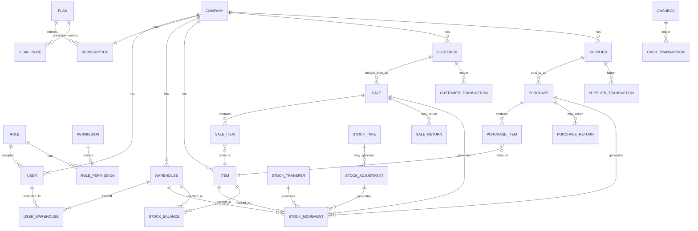

# وثيقة المعمارية الرسمية — Makhzani (مخزني) SaaS

هذه الوثيقة هي التسليم المطلوب في **البند 69** من المواصفات (قبل بدء كتابة أي كود تنفيذي).
تغطي: قرار التقنية، المعمارية الطبقية، الـ ERD، هيكل الـ API، مصفوفة الصلاحيات، خريطة الشاشات،
معمارية الاشتراكات، منطق حركة المخزون، دورة حياة المستندات، معمارية الأمان، وخارطة الطريق.

**الحالة: مسودة للمراجعة والاعتماد — لم يبدأ تنفيذ أي كود عمل (Business Logic) بعد.**

---

## 1. قرار التقنية (Tech Stack)

بما أن النشر سيكون على **Vercel** والكود على **GitHub**، وبما أنك ذكرت أنك لا تعرف طريقة
التثبيت والتشغيل إطلاقًا، تم اختيار Stack واحد متجانس (Monolith منظم داخليًا بطبقات) لتقليل
عدد الأدوات التي تحتاج للتعامل معها:

| الطبقة | الاختيار | السبب |
|---|---|---|
| اللغة | TypeScript | Type Safety يقلل الأخطاء في نظام مالي/مخزني |
| الإطار | **Next.js 14+ (App Router)** | يجمع Frontend + Backend (API) في مشروع واحد، ودعم Vercel Native 100% |
| قاعدة البيانات | **PostgreSQL** | تدعم Transactions المعقدة والـ Constraints بشكل أفضل من MySQL لهذا النوع من الأنظمة |
| استضافة قاعدة البيانات | **Supabase** | لديك حساب بالفعل — لا حاجة لخدمة جديدة. نستخدم منها Postgres فقط في هذه المرحلة (Auth/Storage الخاصان بـ Supabase غير مستخدَمين؛ المصادقة عبر NextAuth كما هو موضّح لاحقًا) |
| ORM | **Prisma** | يولّد Types تلقائيًا، يمنع SQL Injection بشكل افتراضي، ويعمل كوثيقة Schema حية |
| المصادقة | **NextAuth.js (Credentials) + JWT Session** | الجلسة تحمل `userId + companyId + roleId` لعزل الـ Tenant |
| الواجهة | **Tailwind CSS + shadcn/ui** | تصميم حديث سريع، ودعم RTL جاهز عبر `dir="rtl"` |
| الترجمة | **next-intl** (قاموس `ar.json` فقط الآن) | بنية جاهزة لإضافة `en.json` لاحقًا بدون إعادة هيكلة |
| رفع الملفات (لاحقًا) | Vercel Blob | لصور الأصناف وشعارات الشركات |
| المهام المجدولة | Vercel Cron Jobs | لفحص انتهاء الاشتراكات، الإشعارات، التنبيهات اليومية |
| بوابات الدفع | Interface موحّد `PaymentGateway` (بند 49) | تطبيقات لاحقة: Paymob / Stripe / Fawry حسب الدولة |

> **ملاحظة تقنية عن Supabase + Prisma:** Supabase يوفّر رابط اتصال عبر Connection Pooler
> (pgbouncer) للاستخدام وقت التشغيل، ورابطًا مباشرًا لعمليات الـ Migration. لذلك يوجد متغيرا بيئة
> اثنان: `DATABASE_URL` (Pooler، يُستخدم في كل الكود) و`DIRECT_URL` (مباشر، يُستخدم فقط بواسطة
> Prisma عند `migrate`) — كلاهما موجودان في `prisma/schema.prisma` وفي `INSTALL.md`.

> **لماذا Next.js وليس Backend/Frontend منفصلين؟** لأنك ذكرت أنك لا تعرف طريقة التشغيل نهائيًا.
> مشروعان منفصلان يعني إعداد استضافتين، واتصال CORS، وملفي بيئة. مشروع Next.js واحد يعني:
> `git push` → Vercel يبني وينشر تلقائيًا. هذا أبسط بكثير لشخص يبدأ من الصفر.

---

## 2. المعمارية الطبقية (Layered Architecture)

```
┌─────────────────────────────────────────────┐
│  UI (React Server/Client Components)         │  app/(tenant)/**, app/(admin)/**
├─────────────────────────────────────────────┤
│  API Layer (Route Handlers + Server Actions)  │  app/api/v1/**
├─────────────────────────────────────────────┤
│  Authorization Middleware                      │  requirePermission(), tenantContext()
├─────────────────────────────────────────────┤
│  Business Logic / Services                     │  lib/services/**  (Inventory Engine, Billing…)
├─────────────────────────────────────────────┤
│  Data Access (Prisma Client + Tenant Guard)    │  lib/db/**
├─────────────────────────────────────────────┤
│  PostgreSQL (Neon)                             │
└─────────────────────────────────────────────┘
```

### هيكل المجلدات المقترح

```
stock-prog/
├── prisma/
│   ├── schema.prisma
│   └── migrations/
├── src/
│   ├── app/
│   │   ├── (auth)/login, register, forgot-password
│   │   ├── (tenant)/[companySlug]/dashboard, sales, purchases, inventory, ...
│   │   ├── (admin)/admin/companies, plans, payments, ...
│   │   └── api/v1/{items,customers,suppliers,sales,purchases,stock}/route.ts
│   ├── lib/
│   │   ├── auth/            # NextAuth config, session helpers
│   │   ├── db/               # Prisma client + tenant-scoped query wrapper
│   │   ├── services/
│   │   │   ├── inventory/     # محرك حركة المخزون (الأهم)
│   │   │   ├── sales/
│   │   │   ├── purchases/
│   │   │   ├── billing/       # Subscriptions/Plans/Limits
│   │   │   └── audit/
│   │   ├── permissions/       # كتالوج الصلاحيات + دوال التحقق
│   │   └── i18n/
│   ├── components/
│   └── middleware.ts          # فرض tenant + auth على كل Route
├── docs/                       # هذه الوثائق
└── README.md / INSTALL.md
```

**قاعدة صارمة:** الطبقة الوحيدة المسموح لها بالكتابة في قاعدة البيانات هي `lib/services/**`.
الـ UI والـ API Routes لا تكتب Business Logic ولا تصل لـ Prisma مباشرة (بند 64).

---

## 3. عزل بيانات الشركات (Multi-Tenancy Strategy)

**النموذج المختار: Shared Database, Shared Schema, عزل عبر `companyId`.**
(هذا هو الخيار الأنسب لعدد كبير من الشركات الصغيرة/المتوسطة من ناحية التكلفة وسهولة الصيانة،
مقابل Database-per-Tenant الذي يكون أغلى ويصعب ترحيله لاحقًا لو دعت الحاجة لعميل كبير جدًا).

آلية الفرض (لا تعتمد على "تذكّر" المطور إضافة الفلتر يدويًا في كل Query):

1. عند تسجيل الدخول، الجلسة (JWT) تحمل `companyId` بشكل موقّع (Signed) لا يمكن للمستخدم تعديله.
2. **Prisma Client Extension** مركزي (`lib/db/tenantClient.ts`) يعترض كل عملية `findMany / findFirst /
   update / delete / count` على الجداول التي تحوي `companyId`، ويضيف الشرط تلقائيًا من الـ Context
   الحالي — بحيث حتى لو نسي المطور كتابة `where: { companyId }`، الاستعلام يبقى محميًا.
3. أي Route Handler يبدأ بـ `const { companyId, userId } = await requireTenant(req)` قبل أي شيء.
4. **اختبار إلزامي قبل الإطلاق (بند 65):** محاولة وصول مستخدم من Company A إلى سجل من Company B
   عبر تعديل الـ ID في الـ URL مباشرة — يجب أن يرجع 404 وليس 403 (لإخفاء وجود السجل أصلًا).
5. لوحة SaaS Admin هي الاستثناء الوحيد المصرَّح له برؤية بيانات متعددة الشركات، ولها Auth منفصل
   تمامًا (`PlatformAdmin` جدول مستقل، لا علاقة له بجدول `User` الخاص بالشركات).

---

## 4. ERD — العلاقات الأساسية

المرجع الكامل والدقيق هو [`prisma/schema.prisma`](../prisma/schema.prisma) (كل الأعمدة، الأنواع،
المفاتيح، الفهارس). المخطط التالي يعرض العلاقات المحورية فقط:



**العلاقة الجوهرية التي يقوم عليها كل شيء:** كل مستند مالي (شراء/بيع/مرتجع/تحويل/تسوية) عند
اعتماده **يُنتج** سطرًا أو أكثر في `stock_movements`، وقد يُنتج سطرًا في `customer_transactions` أو
`supplier_transactions` أو `cash_transactions`. لا يوجد أي مسار آخر لتعديل هذه الجداول (لا تعديل يدوي).

---

## 5. محرك حركة المخزون (Stock Movement Engine) — بند 26 و30 و66

### 5.1 المبدأ

`stock_movements` هو **مصدر الحقيقة الوحيد**. لا حقل "رصيد" يُعدَّل يدويًا في أي مكان.

```
Stock Balance(item, warehouse) = SUM(qtyIn) - SUM(qtyOut)  FROM stock_movements
```

لأداء أفضل مع مئات الآلاف من الأصناف وملايين الحركات، يُحتفظ بجدول Cache وهو `stock_balances`
(رصيد حالي + متوسط تكلفة حالي لكل زوج item+warehouse)، ويُحدَّث ضمن نفس الـ Transaction التي
تُنشئ الحركة — أبدًا بشكل منفصل أو مؤجل.

### 5.2 التكلفة — Moving Average Cost

```
New Avg Cost = (Old Qty × Old Avg Cost + Purchased Qty × Purchase Unit Cost)
               ─────────────────────────────────────────────────────────────
               (Old Qty + Purchased Qty)
```

- تُحسب فقط عند حركات **IN** التي تحمل تكلفة حقيقية (شراء، تسوية موجبة بتكلفة مقدَّرة، رصيد افتتاحي).
- حركات **OUT** (بيع، تحويل صادر، هالك) تستخدم `avgCost` الحالي وقت الحركة ولا تُغيّره.
- كل سطر في `stock_movements` يخزّن `unitCost` و`totalCost` وقت وقوع الحركة فعليًا (Snapshot) —
  **ممنوع إعادة حساب فواتير قديمة** بأثر رجعي (بند 30)؛ أي تصحيح لاحق يكون عبر مستند
  "إعادة تقييم مخزون" (Stock Revaluation) صريح يُنشئ حركاته الخاصة.

### 5.3 مثال التتبع الإلزامي (بند 66) — يجب أن يمر هذا Test Case بدون تدخل يدوي

```
الحالة الابتدائية:  Laptop, Opening Stock = 100 @ 10,000  →  avgCost = 10,000
شراء:               20 وحدة @ 11,000
  New Avg = (100×10,000 + 20×11,000) / 120 = 10,166.667
بيع:                30 وحدة
  Cost of Sale = 30 × 10,166.667 = 305,000
  Stock بعد البيع = 90 @ avgCost 10,166.667 (التكلفة لا تتغير عند البيع)
  Profit = (Sale Price × 30) - 305,000
```

كل هذا يحدث تلقائيًا داخل `services/sales/postSale.ts` ضمن Transaction واحدة.

### 5.4 أنواع الحركة والمستندات المُنتِجة لها

| المستند | عند الاعتماد يُنتج |
|---|---|
| فاتورة شراء | `PURCHASE` (IN) + قيد مورد (Credit) + قيد خزينة إن وُجد دفع |
| مرتجع مشتريات | `PURCHASE_RETURN` (OUT) + قيد مورد (Debit) |
| فاتورة بيع | `SALE` (OUT) + قيد عميل (Debit) + قيد خزينة إن وُجد تحصيل |
| مرتجع مبيعات | `SALE_RETURN` (IN) + قيد عميل (Credit) + قيد خزينة إن وُجد رد نقدي |
| تحويل مخزني | `TRANSFER_OUT` من المصدر + `TRANSFER_IN` للوجهة (نفس Transaction) |
| إضافة مخزون | `STOCK_ADJUSTMENT_IN` أو `OPENING_BALANCE` |
| صرف مخزون | `STOCK_ADJUSTMENT_OUT` أو `DAMAGE` |
| فرق الجرد الموجب | `STOCK_ADJUSTMENT_IN` تلقائي |
| فرق الجرد السالب | `STOCK_ADJUSTMENT_OUT` تلقائي |

### 5.5 فحص المخزون السالب

قبل أي حركة `OUT`: `if (!company.allowNegativeStock && availableQty < requestedQty) throw`.
هذا الفحص **داخل نفس الـ DB Transaction** (باستخدام `SELECT … FOR UPDATE` أو Serializable
Isolation على صف `stock_balances`) لمنع Race Condition عند بيع متزامن من أكثر من مستخدم لنفس الصنف.

---

## 6. دورة حياة المستندات (Document Workflow) — بند 40، 41

```
DRAFT ──► PENDING ──► APPROVED ──► POSTED
  │                                   │
  └──────────► CANCELLED ◄────────────┘
                   (Reverse Transaction تُنشأ، لا حذف)
```

- **DRAFT / PENDING / APPROVED**: لا تأثير على المخزون أو الحسابات. قابلة للتعديل والحذف الفعلي
  (لأنها لم تُنتج أي أثر مالي بعد).
- **POSTED**: نُفِّذت كل الأثار (حركة مخزون + قيود عميل/مورد/خزينة + Audit Log) ضمن Transaction واحدة.
  من هذه اللحظة **يُمنع الحذف نهائيًا**.
- **CANCELLED**: لا يُحذف المستند. يُنشأ له **Reverse Movement** بنفس القيم بإشارة معكوسة
  (`qtyIn ↔ qtyOut`)، مرتبط بنفس `documentId` الأصلي حتى يبقى الأثر التاريخي متتبَّعًا بالكامل.
- كل انتقال حالة (وخصوصًا `→ POSTED` و`→ CANCELLED`) يمر عبر دالة خدمة واحدة (مثل
  `postPurchase(id)`) تُنفَّذ بالكامل داخل `prisma.$transaction([...])`؛ فشل أي خطوة يُلغي كل الخطوات.

---

## 7. الصلاحيات (Permissions) — Permission-Based وليس Role-Based فقط

### 7.1 البنية

- `permissions`: كتالوج عام ثابت على مستوى المنصة (`items.view`, `sales.approve`, `stock.view_cost` …).
- `roles`: أدوار مخصّصة **لكل شركة** (كل شركة تُنشئ أدوارها الخاصة عند التسجيل: Owner, Admin,
  Accountant, Warehouse Manager, Storekeeper, Sales, Cashier, Viewer — كنقطة بداية قابلة للتعديل).
- `role_permissions`: ربط الدور بالصلاحيات.
- `user_permissions`: استثناء فردي (Grant إضافي أو Deny يتخطى صلاحية الدور) لمستخدم بعينه.
- `user_warehouses`: تقييد المستخدم بمخازن محددة (بند 38) — إن كانت القائمة فارغة فله كل المخازن.

### 7.2 مصفوفة الأدوار الافتراضية (نقطة انطلاق، قابلة للتعديل بالكامل لكل شركة)

| الوحدة / الدور | Owner | Admin | Accountant | Wh. Manager | Storekeeper | Sales | Cashier | Viewer |
|---|:---:|:---:|:---:|:---:|:---:|:---:|:---:|:---:|
| الأصناف (View/Create/Edit) | ✓ | ✓ | – | ✓ | View | View | View | View |
| رؤية التكلفة (view_cost) | ✓ | ✓ | ✓ | ✓ | – | – | – | – |
| رؤية الربح (view_profit) | ✓ | ✓ | ✓ | – | – | – | – | – |
| فاتورة بيع (Create) | ✓ | ✓ | – | – | – | ✓ | ✓ | – |
| اعتماد بيع (Approve) | ✓ | ✓ | – | – | – | – | – | – |
| فاتورة شراء (Create) | ✓ | ✓ | – | ✓ | – | – | – | – |
| اعتماد شراء (Approve) | ✓ | ✓ | – | – | – | – | – | – |
| تسوية مخزون (Approve) | ✓ | ✓ | – | ✓ | – | – | – | – |
| السماح بمخزون سالب | ✓ | ✓ | – | – | – | – | – | – |
| تغيير الأسعار | ✓ | ✓ | – | – | – | – | – | – |
| الخزينة (تحصيل/سداد) | ✓ | ✓ | ✓ | – | – | – | ✓ | – |
| التقارير (كل الأنواع) | ✓ | ✓ | ✓ | View مخزنه | View مخزنه | مبيعاته | – | ✓ |
| الإعدادات/المستخدمون | ✓ | ✓ | – | – | – | – | – | – |

**لكل Module يوجد دائمًا**: `view, create, edit, delete, print, approve, cancel, export` كأفعال منفصلة
قابلة للتفعيل بشكل مستقل (بند 37).

### 7.3 الفرض في الكود

```ts
// كل Route/Server Action حساس:
await requirePermission(session, "sales.approve");
// لا يوجد أي فحص صلاحيات في الـ Frontend فقط — الواجهة تُخفي الأزرار للتجربة فقط،
// لكن Backend يرفض العملية حتى لو استُدعي الـ API مباشرة (بند 51).
```

---

## 8. معمارية الاشتراكات (Subscription / Billing Architecture) — بند 46-49

### 8.1 المكونات

- `plans`: خطط عامة على مستوى المنصة، بالحدود (`maxUsers, maxWarehouses, maxItems,
  maxMonthlyDocuments, maxStorageMb`) و`features: Json` للميزات المرنة (تقارير متقدمة، API…).
  **لا حدود مكتوبة داخل الكود** — كل التحقق يقرأ من هذا الجدول (بند 47).
- `subscriptions`: اشتراك الشركة الحالي (1:1 مع Company)، بحالة `TRIALING / ACTIVE / PAST_DUE /
  EXPIRED / CANCELLED`.
- `payments`: سجل المدفوعات مرتبط بالاشتراك، عبر `PaymentGateway` Interface موحّد:

```ts
interface PaymentGateway {
  createCheckout(subscription, plan): Promise<{ redirectUrl: string }>;
  verifyWebhook(payload, signature): Promise<PaymentResult>;
  refund(paymentId): Promise<void>;
}
// أول تطبيق فعلي (Phase 14): PayTabsGateway — يغطي السعودية ومصر بتكامل واحد (بند التالي)
// تطبيقات لاحقة عند الحاجة: PaymobGateway (تفصيل أكبر لمحافظ/بنوك مصر)، StripeGateway (عالمي)
```

### 8.2 الدول المستهدفة، العملات، والتسعير

الدولتان الأساسيتان الآن: **السعودية (أولًا)** ثم **مصر (ثانيًا)**، مع إتاحة التسجيل من أي دولة
أخرى مبدئيًا بعملة **الجنيه المصري (EGP)** كافتراضي. التصميم لا يُقيّد النظام بدولة أو عملة واحدة
(بند 55) — الآلية:

- **تسعير الخطط لكل دولة**: جدول `plan_prices` يربط كل خطة (`Plan`) بسعر مختلف حسب `countryCode`:
  مثال `SA → 149 SAR`, `EG → 499 EGP`. أي دولة أخرى ليس لها سطر خاص تُستخدم لها قيمة
  `Plan.price` / `Plan.currency` الافتراضية (EGP) تلقائيًا — لا حاجة لإضافة كل دول العالم يدويًا.
- **ملحوظة تحويل تقريبية للعرض فقط**: عند عرض السعر لدولة غير مدرَجة، تظهر ملحوظة صغيرة أسفل
  السعر مبنية على جدول `exchange_rate_notes` (يحدَّثه SaaS Admin يدويًا بين الحين والآخر — **ليس**
  سعر صرف حي عبر API خارجي، تجنّبًا للتعقيد والتكلفة): مثال
  `499 ج.م  (≈ 65 ر.س / 10 $ تقريبًا)`. هذه الملحوظة توضيحية بحتة ولا تُستخدم أبدًا كأساس فعلي
  للفوترة أو الاسترداد — القيمة المحصَّلة فعليًا هي دائمًا بعملة سطر `plan_prices` المطابق لدولة
  الشركة (أو الافتراضي EGP).
- **الضرائب**: لا نسبة ضريبة مكتوبة في الكود. `Item.taxRate` ونسبة الضريبة الافتراضية في إعدادات
  الشركة (`Setting`) قيم حرة لكل شركة، بحيث تضبط كل شركة نسبتها المحلية بنفسها (15% في السعودية،
  14% في مصر، أو غيرها) دون تعديل برمجي.
- **بوابة الدفع الأولى (Phase 14)**: **PayTabs** — لأنها تغطي السعودية ومصر (وباقي دول الخليج
  والأردن) بتكامل واحد، فتناسب السوقين المستهدفين مباشرة بأقل جهد تكامل. يمكن إضافة Paymob
  لاحقًا كخيار ثانٍ لمصر تحديدًا (تغطية أوسع لمحافظ موبايل/فوري محليًا) دون أي تعديل في باقي
  النظام — فقط تطبيق جديد لنفس `PaymentGateway` Interface.

### 8.3 دورة التسجيل (بند 5)

عند التسجيل، ضمن Transaction واحدة:
`Company → Owner User → Owner Role (كل الصلاحيات) → Default Settings → Default Warehouse →
Default CashBox → Subscription(status=TRIALING, plan=Trial, trialEnd=now+N days)`.

### 8.4 فرض الحدود

Middleware خفيف (`enforceLimit(companyId, "users")`) يُستدعى **قبل** أي عملية إنشاء (مستخدم جديد،
مخزن جديد، صنف جديد...) — يقارن `COUNT(*)` الحالي بـ `plan.maxX`. عند التجاوز: خطأ واضح + اقتراح
ترقية الخطة، وليس Silent Failure.

### 8.5 انتهاء الفترة التجريبية / الاشتراك

Vercel Cron يومي (`/api/cron/check-subscriptions`) يفحص كل الاشتراكات:
- `trialEnd` أو `currentPeriodEnd` تجاوز اليوم → `status = EXPIRED`.
- عند `EXPIRED`: **يُسمح بتسجيل الدخول وعرض البيانات (Read-Only)**، **يُمنع أي إنشاء/تعديل/اعتماد
  جديد**، مع رسالة واضحة لترقية الاشتراك. **لا حذف لبيانات الشركة أبدًا.**
- إشعار قبل 7 أيام و3 أيام و1 يوم من الانتهاء (بند 45).

---

## 9. معمارية الأمان (Security Architecture) — بند 51

| المخاطرة | آلية الحماية |
|---|---|
| SQL Injection | Prisma (Parameterized Queries حصريًا)، ممنوع أي Raw SQL بدون مراجعة |
| XSS | React (Escaping تلقائي) + `Content-Security-Policy` header |
| CSRF | NextAuth CSRF Token على كل POST/Server Action |
| Session Hijacking | JWT موقّع + HttpOnly + Secure Cookies + انتهاء صلاحية + Rotation |
| كشف بيانات شركة أخرى | Prisma Client Extension يفرض `companyId` تلقائيًا (قسم 3) |
| تصعيد صلاحيات (Privilege Escalation) | كل تعديل صلاحيات يمر عبر Owner/Admin فقط + Audit Log |
| Rate Limiting | على `/api/auth/*` و`/api/v1/*` (Vercel Edge Middleware + قاعدة IP+User) |
| كلمات المرور | `bcrypt`/`argon2` Hash، لا تُخزَّن أبدًا كنص واضح |
| النسخ الاحتياطي | Neon Point-in-Time Recovery + Backup يومي (بند 61) |
| Audit Log | كل عملية حساسة (قسم 39) → لا يوجد Delete API لهذا الجدول |
| تحقق من صحة المدخلات | Zod schema على كل حدود API (Server-side، ليس فقط Frontend) |

**قاعدة ذهبية:** أي فحص صلاحية أو Business Rule يظهر في الواجهة **يجب** أن يتكرر في الـ Backend.
الواجهة تجميل فقط.

### 9.1 حالة التنفيذ الفعلية (بعد تدقيق Phase 16)

| البند أعلاه | الحالة |
|---|---|
| SQL Injection | ✅ منفَّذ — Prisma فقط، الاستثناء الوحيد (`stockMovement.ts`'s `$queryRaw` لقفل الصف) يستخدم `Prisma.sql` المُعامَل، لا تسلسل نصي |
| كشف بيانات شركة أخرى | ✅ منفَّذ ومُختبَر آليًا (`tests/tenantIsolation.test.ts`) |
| تصعيد صلاحيات | ✅ **أُصلح في Phase 16** — كان الكتالوج/الأدوار مبنيَّين منذ Phase 1 لكن غير مفروضين فعليًا في أي Server Action؛ الآن `checkPermission()` مفروض في كل الأكشنز الحساسة (`tests/rbac.test.ts`) |
| Rate Limiting | ✅ **أُضيف في Phase 16** — جدول `LoginAttempt` (DB-backed، يعمل عبر نسخ Vercel Serverless)، يمنع تسجيل الدخول (شركات وأدمن) بعد 5 محاولات فاشلة خلال 15 دقيقة |
| النسخ الاحتياطي | ⚠️ Supabase (وليس Neon كما في المسودة الأصلية) — راجع `docs/BACKUP_AND_RECOVERY.md`، Free Tier لا يوفر نسخًا تلقائية، فأُضيف GitHub Action يومي بديل |
| Audit Log | ✅ موسَّع في Phase 16 ليشمل إجراءات أدمن المنصة أيضًا (`PlatformAuditLog`) بجانب `AuditLog` الخاص بالشركات |
| CSRF | ✅ Server Actions محمية تلقائيًا من Next.js (فحص Origin)؛ NextAuth CSRF Token لمسار Credentials |

راجع تقرير التدقيق الكامل (الأمان، الاختبارات، الأداء، النسخ الاحتياطي) في ملخص Phase 16.

---

## 10. هيكل الـ API (لدعم تطبيقات مستقبلية / Mobile / تكاملات) — بند 62

```
/api/v1/auth/{login,logout,register,forgot-password,reset-password}
/api/v1/items                 GET, POST
/api/v1/items/:id             GET, PUT, DELETE (soft)
/api/v1/items/search?q=       GET  (بحث سريع: اسم/كود/باركود)
/api/v1/categories            GET, POST
/api/v1/brands                GET, POST
/api/v1/units                 GET, POST
/api/v1/warehouses            GET, POST
/api/v1/customers              GET, POST
/api/v1/customers/:id/statement GET
/api/v1/suppliers              GET, POST
/api/v1/suppliers/:id/statement GET
/api/v1/purchases              GET, POST
/api/v1/purchases/:id/post     POST   (اعتماد)
/api/v1/purchases/:id/cancel   POST
/api/v1/purchase-returns       GET, POST
/api/v1/sales                  GET, POST
/api/v1/sales/:id/post         POST
/api/v1/sales/:id/cancel       POST
/api/v1/sale-returns            GET, POST
/api/v1/stock/movements         GET   (Stock Card)
/api/v1/stock/balances          GET
/api/v1/stock/transfers         GET, POST
/api/v1/stock/adjustments       GET, POST
/api/v1/stock/takes              GET, POST
/api/v1/cash/transactions        GET, POST
/api/v1/reports/{sales,purchases,inventory,customers,suppliers,cash,profit}
/api/v1/notifications             GET
/api/v1/admin/companies           GET, PATCH   (SaaS Admin فقط)
/api/v1/admin/plans                GET, POST, PATCH
/api/v1/admin/payments             GET
```

كل نقطة (عدا `/auth` و`/admin`) تتطلب Header جلسة صالحة، وتُشتق `companyId` من الجلسة **وليس**
من أي معامل في الطلب — لمنع انتحال شركة أخرى عبر تعديل `companyId` في الـ Body.

المصادقة الحالية: NextAuth session cookie. لاستخدام خارجي (تكاملات) لاحقًا: `API Keys` لكل شركة
(جدول `api_keys` يُضاف عند الحاجة الفعلية — غير مطلوب في المرحلة الأولى).

---

## 11. خريطة الشاشات (Screen Map)

### أ) لوحة العميل `/{companySlug}/...`

```
/login, /register, /forgot-password
/dashboard
/sales            /sales/new  /sales/:id  /sales/returns  /sales/returns/new
/purchases        /purchases/new  /purchases/:id  /purchases/returns
/inventory/items  /inventory/categories  /inventory/brands  /inventory/units
/inventory/warehouses  /inventory/transfers  /inventory/adjustments  /inventory/stock-take
/inventory/stock-card  (Stock Movement History لكل صنف)
/customers        /customers/:id (كشف حساب)
/suppliers        /suppliers/:id (كشف حساب)
/cash             /cash/receipts  /cash/payments  /cash/transfers
/reports/{sales,purchases,inventory,customers,suppliers,cash,profit}
/settings/{company,users,roles,warehouses,numbering,notifications,subscription}
```

### ب) لوحة إدارة المنصة `/admin/...`

```
/admin/login
/admin/dashboard
/admin/companies       /admin/companies/:id
/admin/plans           /admin/plans/:id
/admin/payments
/admin/system-settings
```

### تخطيط الواجهة العام

```
┌─ Topbar: [شعار الشركة] [حالة الاشتراك] [إشعارات 🔔] [قائمة المستخدم] ─┐
├─ Sidebar (RTL: يمين الشاشة) ──────────────────────────────────────────┤
│ Dashboard / Sales / Purchases / Inventory / Customers / Suppliers /   │
│ Cash / Reports / Settings                                              │
└──────────────────────────────────────────────────────────────────────┘
```

---

## 12. خارطة الطريق (Roadmap) — تفصيل تنفيذي للمراحل 16 المذكورة في طلبك

| # | المرحلة | أهم التسليمات | معيار الإنجاز (Definition of Done) |
|---|---|---|---|
| 0 | تجهيز المشروع | Next.js + Prisma + Neon + GitHub + Vercel متصلين | Deploy فارغ ناجح على Vercel |
| 1 | Auth + Companies + Users + Roles | تسجيل شركة، دخول/خروج، صلاحيات أساسية | مستخدمان بشركتين مختلفتين لا يرى أحدهما الآخر |
| 2 | Items + Categories + Units + Warehouses | Master Data كاملة + وحدات وتحويلات | إنشاء صنف بوحدتين (قطعة/كرتونة) بنجاح |
| 3 | Stock Movement Engine | `stock_movements` + `stock_balances` + Moving Avg | سيناريو بند 66 يمر تلقائيًا بدون تدخل يدوي |
| 4 | Purchases | طلب/أمر/فاتورة شراء + اعتماد | فاتورة شراء Posted تُنتج حركة + رصيد مورد |
| 5 | Sales | فاتورة بيع + فحص المخزون السالب | بيع يفشل عند تجاوز الرصيد إن كانت الشركة تمنع السالب |
| 6 | Returns | مرتجع بيع/شراء مرتبط بالفاتورة الأصلية | مرتجع يُرجع الرصيد والمديونية بشكل صحيح |
| 7 | Transfers | تحويل بين المخازن | لا يمكن التحويل لنفس المخزن (تحقق Backend) |
| 8 | Stock Take | جرد + توليد تسويات تلقائيًا | فرق الجرد يولّد Adjustment صحيح الاتجاه |
| 9 | Customers + Suppliers | كشف حساب، مديونية، حد ائتمان | تجاوز حد الائتمان يُنتج تنبيهًا |
| 10 | Cash | خزائن، تحصيل، سداد | تحصيل عميل يُخفّض مديونيته ويزيد الخزينة معًا |
| 11 | Cost + Profit | حساب الربح بمستوياته (فاتورة/صنف/عميل/فترة) | تقرير ربح يطابق يدويًا سيناريو بند 66 |
| 12 | Reports | كل التقارير + تصدير PDF/Excel/CSV | كل تقرير يدعم فلاتر التاريخ/المخزن/الصنف |
| 13 | Dashboard | مؤشرات + رسوم بيانية | تحميل Dashboard تحت 2 ثانية مع بيانات تجريبية كبيرة |
| 14 | Subscriptions + Payments | خطط، حدود، Trial، بوابة دفع واحدة كبداية | تجاوز حد الخطة يُمنع برسالة واضحة |
| 15 | Admin Panel | لوحة SaaS Admin كاملة | تعطيل شركة يمنع الدخول فورًا |
| 16 | Security + Testing + Backup | اختبارات بند 65 كاملة + Backup مفعّل | كل اختبارات العزل والصلاحيات تنجح |

**مبدأ العمل:** لا ننتقل لمرحلة تالية قبل اجتياز معيار الإنجاز للمرحلة الحالية. هذا يطابق طلبك
في البند 68 بعدم البدء بكل الشاشات دفعة واحدة.

---

## 13. ملاحظة مهمة حول حالة `prisma/schema.prisma` الحالية

الملف الحالي **مسودة بنيوية كاملة** (كل الجداول، الأعمدة، الأنواع، المفاتيح الأساسية والفهارس
موجودة ومطابقة للبند 53). عند بدء التنفيذ الفعلي في Phase 0/1 سيتم:
1. تشغيل `npx prisma format` و`npx prisma validate` لضبط كل العلاقات ثنائية الاتجاه تلقائيًا.
2. توليد أول Migration فعلية على قاعدة Neon.
هذا إجراء تقني روتيني ولا يغيّر أي قرار معماري وارد في هذه الوثيقة.

---

## 14. ما هو غير مطلوب في النسخة الأولى (لكن البنية تسمح به لاحقًا)

Accounting كامل بقيود مزدوجة، HR/Payroll، Manufacturing، POS مستقل، متجر إلكتروني، تطبيق موبايل،
إشعارات WhatsApp/SMS، تقارير AI. كل هذه **لم تُستبعد بالتصميم** — فقط لم تُبنَ الآن (بند 63).
